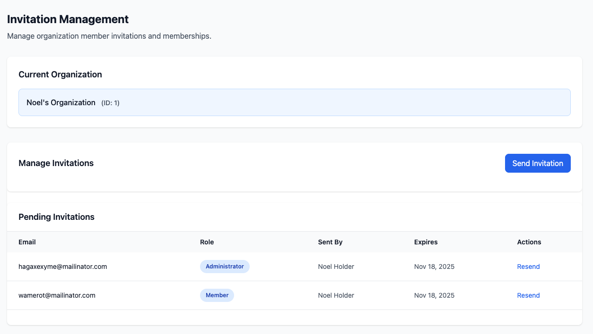

# Organization Invitations

The Organization Invitations system allows organizations to invite users to join via email. The system provides a complete workflow for sending, accepting, declining, and managing invitations with expiration tracking, role assignment, and event-driven architecture.

## Table of Contents

- [Overview](#overview)
- [Model](#model)
- [Actions](#actions)
- [Events](#events)
- [Livewire Component](#livewire-component)
- [Usage Examples](#usage-examples)
- [Testing](#testing)
- [API Reference](#api-reference)
- [Customization](#customization)
- [Best Practices](#best-practices)
- [Troubleshooting](#troubleshooting)

## Overview

Provides email invitations, token security, expiration, role assignment, events, Livewire UI, and resend capability.

## Model

`Invitation` model stores invitation state and lifecycle timestamps. Key helpers:

```php
$invitation->isPending();
$invitation->isAccepted();
$invitation->isDeclined();
$invitation->isExpired();
$invitation->isValid();
$invitation->accept($user);
$invitation->decline();
$invitation->getRoleEnum();
```

Factory states: `pending`, `accepted`, `declined`, `expired`, `admin`, `member`.

## Actions

### SendInvitation

```php
$invitation = (new SendInvitation())->handle(
    organization: $organization,
    invitedBy: auth()->user(),
    email: 'john@example.com',
    role: OrganizationRole::MEMBER,
    expirationDays: 7
);
```

Validates email, uniqueness, pending state. Dispatches `InvitationSent`.

### AcceptInvitation

Adds user to org and marks accepted. Dispatches `InvitationAccepted` + `MemberAdded`.

### DeclineInvitation

Marks declined. Dispatches `InvitationDeclined`.

### ResendInvitation

Regenerates token & expiration. Dispatches `InvitationSent`.

## Events

- `InvitationSent`
- `InvitationAccepted`
- `InvitationDeclined`

Listeners can send emails, log activity, trigger webhooks.

## Livewire Component



`<livewire:org::invitation-manager :organization="$organization" />` provides send, resend, accept/decline UI with notifications.

Core methods:

```php
sendInvitation();
resendInvitation($invitationId);
acceptInvitation($invitationId);
declineInvitation($invitationId);
```

## Usage Examples

Programmatic send, accept via controller, event listening for welcome emails.

## Testing

Use action classes with `Event::fake()` to assert lifecycle events. Example factory usage for each state.

## API Reference

```php
SendInvitation::handle(Organization $o, User $by, string $email, OrganizationRole $role, int $days=7): Invitation
AcceptInvitation::handle(Invitation $i, User $u): Organization
DeclineInvitation::handle(Invitation $i): Invitation
ResendInvitation::handle(Invitation $i, int $days=7): Invitation
```

## Customization

Extend actions to add custom validation (e.g. domain restriction). Publish and edit views for design tweaks.

## Best Practices

1. Validate emails strictly
2. Restrict who can send invitations via policies
3. Use reasonable expiration (7–14 days)
4. Log all invitation lifecycle events
5. Send onboarding after acceptance
6. Periodically clean expired invites
7. Wrap accept in transactions for consistency

## Troubleshooting

- Not expiring: check `isExpired()` logic and timestamps
- Events missing: ensure `EventServiceProvider` registration
- Duplicate membership errors: verify user not already added

## Integration Notes

Links: [Authorization & Policies](./02-authorization-and-policies.md) | [Events](../01-architecture/03-events.md)

## Performance Considerations

Indexes on email/token, pagination for large lists, soft deletes for audit.

Last updated: 2025-11-11
